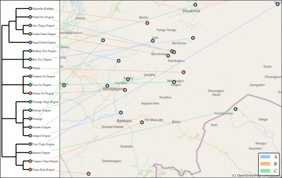

Example maps
-------------

Pseudo maps
*************
These example maps were created directly with glottolog trees (and names) and combined with fake feature data.

Chibchan
+++++++++++

.. include:: examples/chib1249.yaml
   :literal:

.. image:: examples/chib1249.svg
    :width: 100%

New Caledonian
+++++++++++++++

.. include:: examples/newc1243.yaml
   :literal:

.. image:: examples/newc1243.svg
    :width: 100%

Berber
+++++++

.. include:: examples/berb1260.yaml
   :literal:

Dogon
++++++

.. include:: examples/dogo1299.yaml
   :literal:

Tungusic
+++++++++

.. include:: examples/tung1282.yaml
   :literal:

Trans-Himalayan
+++++++++

.. include:: examples/sino1245.yaml
   :literal:

.. image:: examples/sino1245.svg
    :width: 100%

Examples from the wild
************************
These are maps created with ``lingtreemaps`` for actual presentations or publications.

Evidence for an NP constituent in Cariban languages
+++++++++++++++++++++++++++++++++++++++++++++++++++++++

(Spike Gildea & Natalia Cáceres Arandia)

.. image:: examples/cariban_np.svg
    :width: 100%